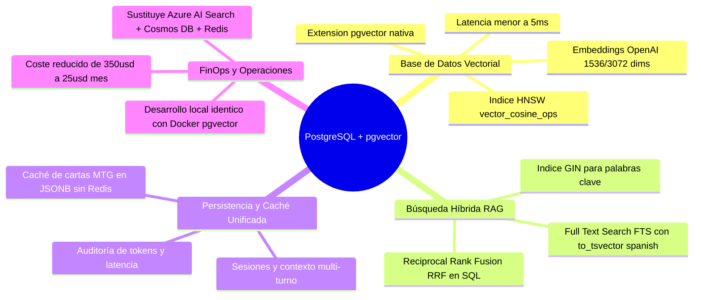
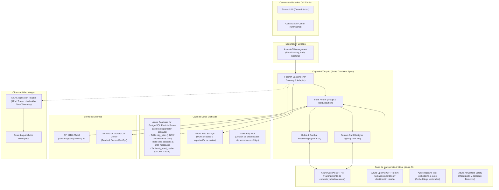
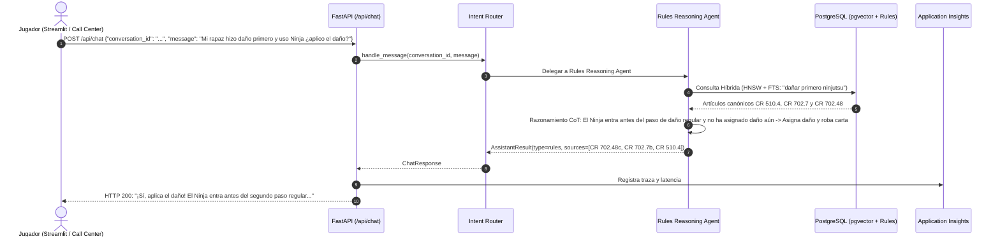

# Arquitectura Productiva: Asistente Call Center de Magic: The Gathering (MTG) en Azure

## 1. Resumen Ejecutivo y Contexto de Negocio

El cliente opera un **Call Center de soporte especializado para jugadores de Magic: The Gathering (MTG)**. El objetivo es automatizar de forma confiable, rápida y precisa la atención a consultas de jugadores mediante un asistente conversacional inteligente desplegado en la nube de **Microsoft Azure**, aprovisionado mediante **Terraform (Infraestructura como Código)**.

### Principio de Diseño: Router-Worker con Agentes Especializados
Para evitar tanto la sobreingeniería (enjambres de 6 agentes innecesarios) como la rigidez de un sistema puramente estático, la arquitectura adopta un patrón **Router-Worker equilibrado**:
* **Router Determinista Central**: Triage instantáneo (<10ms) para clasificación de intención y ejecución directa de herramientas en tareas mecánicas (búsqueda de cartas, filtros, diálogo general).
* **Agentes Especializados donde aportan valor cognitivo real**:
  1. **Rules & Combat Reasoning Agent**: Aplica razonamiento paso a paso (*Chain-of-Thought*) con las reglas canónicas recuperadas para resolver situaciones complejas de combate (ej. *Dañar primero + Ninjutsu*, capas, prioridad).
  2. **Custom Card Designer Agent**: Síntesis creativa y balance de mecánicas evaluando directrices oficiales del *Color Pie* de Wizards of the Coast.
* **Base de Datos Unificada (PostgreSQL + pgvector)**: Vectores HNSW, Full Text Search (FTS), memoria conversacional y caché de cartas JSONB en una sola instancia gestionada. **Sin Redis ni servicios dispersos**.

---

## 2. Viabilidad y Ventajas de PostgreSQL + `pgvector`

### ¿Es viable usar PostgreSQL con `pgvector` para esta solución?
**Sí, es la solución más limpia, coherente y eficiente en costes (FinOps) para este proyecto.**



### Tabla Comparativa de Arquitectura de Datos

| Dimensión | Enfoque Disperso (AI Search + Cosmos DB + Redis) | Enfoque Unificado (**PostgreSQL + `pgvector`**) |
| :--- | :--- | :--- |
| **Complejidad de Infraestructura** | 3 servicios independientes a mantener | **1 único servicio gestionado**: Azure Database for PostgreSQL Flexible Server |
| **Búsqueda Híbrida (Vectores + Texto)** | Requiere indexación y configuración en AI Search | **Nativa en SQL**: HNSW para similitud coseno (`<=>`) + GIN para texto completo (`tsvector`) |
| **Caché de Cartas API** | Servidor de Redis separado con coste adicional | **Tabla `mtg_card_cache`** con columnas JSONB e índices GIN |
| **Coste Mensual (FinOps)** | Alto (~$250 - $350/mes en Azure) | **Muy bajo** (~$15 - $35/mes en tier Burstable B1ms/B2s) |
| **Desarrollo Local y Testing** | Difícil de replicar localmente | **Inmediato**: `docker-compose.yml` con imagen `pgvector/pgvector:pg16` |
| **Consistencia Transaccional (ACID)** | Eventual consistency entre servicios | **ACID completa**: Sesión, mensajes, trazas y caché en una sola base de datos |

---

## 3. Fuentes de Información: API de MTG y Reglamento Oficial

### A. La API de MTG (`docs.magicthegathering.io`)
- La API REST pública alojada en: `https://api.magicthegathering.io/v1/`.
- **Endpoints esenciales**:
  - `/v1/cards`: Catálogo de cartas con nombre, coste (`manaCost`), valor de maná (`cmc`), colores (`colorIdentity`), subtipos (`subtypes`), texto Oracle e imágenes oficiales de Gatherer (`imageUrl`).
  - `/v1/sets`: Nuevos lanzamientos (*releases*) y expansiones.
- **Detalles técnicos integrados**:
  - Encabezado `User-Agent: MTG-Assistant/1.0` obligatorio para evitar bloqueos HTTP 403 anti-bot.
  - **Corrección semántica de `max_cmc`**: No se envía `cmc=max_cmc` a la API (lo que convertía la búsqueda en igualdad exacta y excluía cartas de coste 0). Se recuperan candidatos y se aplica `<= max_cmc` localmente.

### B. El Reglamento Oficial de MTG
- Estándar canónico oficial de Wizards of the Coast:
  1. **Comprehensive Rules (CR)**: Manual de referencia con reglas numeradas del 100 al 903.
  2. **Basic Rulebook**: Guía de fases y conceptos esenciales.
- En [`data/official_rules_mtg.json`](file:///C:/Users/LENOVO/dev/mtg-azure-assistant/data/official_rules_mtg.json) se almacena el dataset estructurado con las reglas oficiales requeridas para las pruebas (Fases del turno CR 500–514, Maná CR 106, Dañar primero CR 702.7 y Ninjutsu CR 702.48).

---

## 4. ¿Por qué es Crítica la "Monitorización" en este Sistema?

En un Call Center asistido por LLMs, la monitorización garantiza la fiabilidad del servicio y el control presupuestario:
1. **Riesgo de Alucinación en Reglas Complejas**: MTG tiene reglas deterministas. La monitorización audita la **Tríada RAG** (*Faithfulness, Context Relevance, Answer Relevance*) asegurando que las respuestas citen reglas oficiales (CR).
2. **KPIs del Call Center**: Mide el First Contact Resolution (FCR), tiempo de respuesta (AHT) y tasa de escalado a jueces humanos de Nivel 2.
3. **Salud de la API Externa**: Registra picos de latencia, fallos HTTP 429 por límites de peticiones y efectividad de la caché en PostgreSQL.
4. **FinOps & Tokens**: Previene bucles de llamadas y audita el consumo de tokens de entrada/salida por conversación.
5. **Seguridad y Guardrails**: Monitoreo de intentos de inyección de prompt (*jailbreaks*) mediante Azure AI Content Safety.

---

## 5. Arquitectura de Servicios en Microsoft Azure



### Detalle de Servicios Seleccionados

| Servicio Azure | Rol en la Solución | Justificación Técnica |
| :--- | :--- | :--- |
| **Azure Container Apps (ACA)** | Hosting del backend FastAPI y orquestación | Serverless, auto-escalado de 1 a 5 réplicas, bajo consumo y despliegue por contenedor Docker. |
| **Azure Database for PostgreSQL Flexible Server** | **Motor Unificado: Vectorial + Relacional + FTS + Caché** | Extensión `pgvector` con índice HNSW para similitud coseno, índice GIN para texto completo, memoria conversacional y tabla `mtg_card_cache` en JSONB. **Elimina la necesidad de Redis y Cosmos DB**. |
| **Azure OpenAI Service** | Modelos LLM (`gpt-4o`, `gpt-4o-mini`, `text-embedding-3-large`) | SLAs empresariales, cumplimiento normativo GDPR y latencia predecible. |
| **Azure Blob Storage** | Almacenamiento de archivos no estructurados | Repositorio de PDFs del reglamento oficial. |
| **Azure Key Vault** | Gestión centralizada de secretos | Acceso por *Managed Identity* sin credenciales en código. |
| **Azure Application Insights & Log Analytics** | Telemetría y Observabilidad APM | Trazabilidad distribuida W3C (OpenTelemetry), latencias p95 y métricas de tokens. |

---

## 6. Esquema de Base de Datos en PostgreSQL (`pgvector`)

El archivo [`src/services/schema.sql`](file:///C:/Users/LENOVO/dev/mtg-azure-assistant/src/services/schema.sql) define la estructura unificada sin Redis:

```sql
-- 1. Extensiones
CREATE EXTENSION IF NOT EXISTS vector;
CREATE EXTENSION IF NOT EXISTS "uuid-ossp";

-- 2. Base de Conocimiento de Reglas con Búsqueda Híbrida (Vectorial + FTS)
CREATE TABLE mtg_rules (
    id UUID PRIMARY KEY DEFAULT uuid_generate_v4(),
    rule_number VARCHAR(50) NOT NULL,
    category VARCHAR(100) NOT NULL,
    title VARCHAR(255) NOT NULL,
    content TEXT NOT NULL,
    metadata JSONB DEFAULT '{}'::jsonb,
    embedding vector(1536),
    tsv_content tsvector GENERATED ALWAYS AS (
        to_tsvector('spanish', coalesce(title, '') || ' ' || coalesce(content, ''))
    ) STORED
);

CREATE INDEX idx_mtg_rules_hnsw ON mtg_rules USING hnsw (embedding vector_cosine_ops);
CREATE INDEX idx_mtg_rules_tsv ON mtg_rules USING gin (tsv_content);

-- 3. Memoria Conversacional del Call Center
CREATE TABLE chat_sessions (
    conversation_id VARCHAR(64) PRIMARY KEY,
    user_id VARCHAR(64) NOT NULL,
    created_at TIMESTAMP WITH TIME ZONE DEFAULT NOW()
);

CREATE TABLE chat_messages (
    id BIGSERIAL PRIMARY KEY,
    conversation_id VARCHAR(64) REFERENCES chat_sessions(conversation_id) ON DELETE CASCADE,
    role VARCHAR(20) NOT NULL,
    content TEXT NOT NULL,
    sources JSONB,
    cards JSONB,
    active_filters JSONB,
    tokens_input INT DEFAULT 0,
    tokens_output INT DEFAULT 0,
    latency_ms INT DEFAULT 0,
    created_at TIMESTAMP WITH TIME ZONE DEFAULT NOW()
);

-- 4. Caché de Cartas API MTG (Sustituye Redis con JSONB nativo)
CREATE TABLE mtg_card_cache (
    card_id VARCHAR(100) PRIMARY KEY,
    name VARCHAR(255) NOT NULL,
    colors TEXT[],
    cmc NUMERIC(5,2),
    types TEXT[],
    subtypes TEXT[],
    image_url TEXT,
    raw_data JSONB NOT NULL,
    cached_at TIMESTAMP WITH TIME ZONE DEFAULT NOW()
);
```

---

## 7. Despliegue con Terraform (IaC)

Toda la infraestructura cloud se despliega mediante Terraform desde [`infra/terraform/`](file:///C:/Users/LENOVO/dev/mtg-azure-assistant/infra/terraform):

```bash
cd infra/terraform
terraform init
terraform validate
```

Recursos creados automáticamente:
* `azurerm_resource_group`: Grupo de recursos centralizado.
* `azurerm_log_analytics_workspace` & `azurerm_application_insights`: Pila de observabilidad APM.
* `azurerm_storage_account` & contenedores blob: Repositorio de reglamentos y assets.
* `azurerm_postgresql_flexible_server`: PostgreSQL 16 con extensión `VECTOR` habilitada y base de datos `mtg_callcenter_db`. **(Sin Redis)**.
* `azurerm_cognitive_account` & despliegues: `gpt-4o`, `gpt-4o-mini` y embeddings.
* `azurerm_key_vault`: Gestión de secretos.
* `azurerm_container_app_environment` & `azurerm_container_app`: Backend FastAPI conectado a PostgreSQL vía `DATABASE_URL`.

---

## 8. Flujo de Resolución del Caso de Combate (Rapaz + Ninja)

Ilustra la resolución determinista ejecutada por el **Rules Reasoning Agent**:


