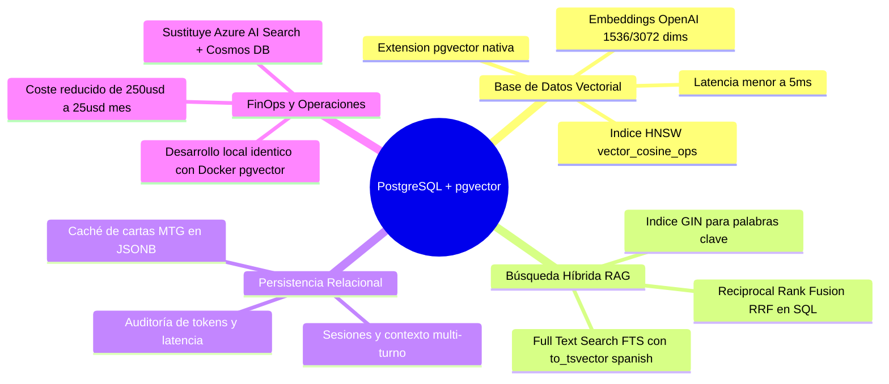
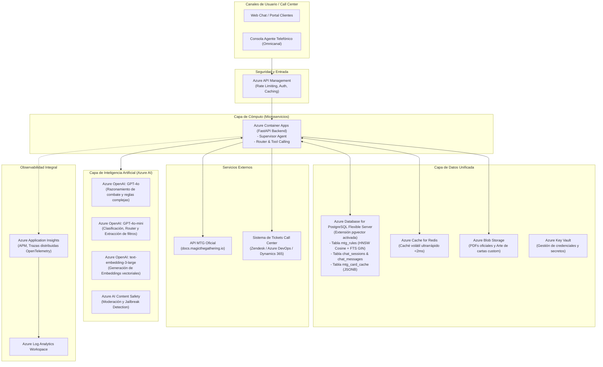
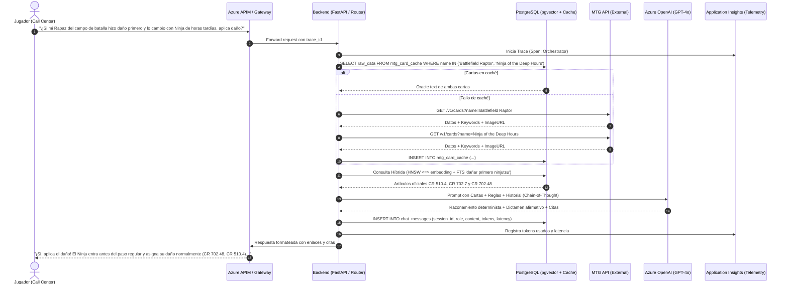

# Arquitectura Productiva: Asistente Call Center de Magic: The Gathering (MTG) en Azure

## 1. Resumen Ejecutivo y Contexto de Negocio

El cliente opera un **Call Center de soporte especializado para jugadores de Magic: The Gathering (MTG)**. El objetivo es automatizar de forma confiable, rápida y precisa la atención a consultas de jugadores mediante un asistente conversacional inteligente desplegado en la nube de **Microsoft Azure**, aprovisionado íntegramente mediante **Terraform (Infraestructura como Código)** y utilizando **PostgreSQL con la extensión `pgvector`** como motor unificado de base de datos vectorial, relacional y búsqueda híbrida.

### Capacidades del Sistema Requeridas
1. **Resolución de Reglas Básicas**: Fases de turno, reserva y fuentes de maná, prioridad, paso de turno (RAG sobre el reglamento oficial canónico de Wizards of the Coast).
2. **Interacciones Complejas entre Cartas**: Resolución determinista paso a paso de situaciones de juego (ej. Dañar primero con *Rapaz del campo de batalla* + Ninjutsu con *Ninja de horas tardías*).
3. **Búsqueda Avanzada de Cartas**: Extracción de entidades y filtrado estructurado consumiendo la API de MTG (`https://docs.magicthegathering.io/` / `https://api.magicthegathering.io/v1/`) para devolver detalles e imágenes oficiales de Gatherer.
4. **Creación de Cartas Custom (Bonus)**: Generación creativa guiada por el *Color Pie* de MTG, balance de juego y generación de arte/tarjetas visuales.
5. **Observabilidad y Gobernanza (Monitorización)**: Telemetría de extremo a extremo, prevención de alucinaciones en reglas y control de costes.
6. **Infraestructura como Código (IaC)**: Automatización completa del despliegue en Azure mediante **Terraform**.
7. **Base de Datos Unificada**: **PostgreSQL + `pgvector`** para vectores HNSW, búsqueda léxica (Full Text Search), caché y memoria multi-turno.

---

## 2. Viabilidad y Ventajas de PostgreSQL + `pgvector`

### ¿Es viable usar PostgreSQL con `pgvector` para esta solución?
**Sí, no solo es 100% viable, sino que es la solución más robusta, limpia y eficiente en costes (FinOps) para este proyecto.**



### Tabla Comparativa de Arquitectura de Datos

| Dimensión | Enfoque Disperso (AI Search + Cosmos DB) | Enfoque Unificado (**PostgreSQL + `pgvector`**) |
| :--- | :--- | :--- |
| **Complejidad de Infraestructura** | 3 servicios independientes (Search + NoSQL + Redis) | **1 único servicio gestionado**: Azure Database for PostgreSQL Flexible Server |
| **Búsqueda Híbrida (Vectores + Texto)** | Requiere indexación y configuración en AI Search | **Nativa en SQL**: HNSW para similitud coseno (`<=>`) + GIN para texto completo (`tsvector`) |
| **Coste Mensual (FinOps)** | Alto (~$200 - $350/mes en Azure) | **Muy bajo** (~$15 - $35/mes en tier Burstable B1ms/B2s) |
| **Desarrollo Local y Testing** | Difícil de replicar localmente sin emuladores pesados | **Inmediato**: `docker-compose.yml` con imagen `pgvector/pgvector:pg16` |
| **Consistencia Transaccional (ACID)** | Eventual consistency entre servicios | **ACID completa**: Sesión, mensajes, trazas y caché en una sola transacción |

---

## 3. Aclaración sobre Fuentes de Información: API de MTG y Reglamento Oficial

### A. La API de MTG (`docs.magicthegathering.io`)
- El enlace proporcionado (`https://docs.magicthegathering.io/`) documenta la API REST pública alojada en: `https://api.magicthegathering.io/v1/`.
- **Endpoints esenciales**:
  - `/v1/cards`: Catálogo de cartas con nombre, coste (`manaCost`), valor de maná (`cmc`), colores (`colorIdentity`), subtipos (`subtypes`), texto Oracle e imágenes oficiales de Gatherer (`imageUrl`).
  - `/v1/sets`: Todos los nuevos lanzamientos (*releases*) y expansiones.
- **Validación técnica en vivo**:
  - Para evitar bloqueos HTTP 403 (protección anti-bot de Cloudflare), las peticiones deben incluir un encabezado `User-Agent: MTG-Assistant/1.0`.
  - La consulta para *"carta blanca de coste menor a 2 que sea guerrero"* validada devuelve cartas reales como *Dragon Hunter*, *Aven Skirmisher* y *Mardu Woe-Reaper* con sus imágenes oficiales.

### B. El Reglamento Oficial de MTG
- Dado que en ocasiones el cliente no adjunta el documento físico en el correo, utilizamos el estándar oficial canónico de Wizards of the Coast:
  1. **Comprehensive Rules (CR)**: Manual oficial de referencia con reglas numeradas del 100 al 903.
  2. **Basic Rulebook**: Guía oficial de fases y conceptos esenciales.
- En [`data/official_rules_mtg.json`](file:///C:/Users/LENOVO/dev/mtg-azure-assistant/data/official_rules_mtg.json) se encuentra el dataset estructurado con las reglas requeridas para los casos de prueba (Fases del turno CR 500–514, Maná CR 106, Dañar primero CR 702.7 y Ninjutsu CR 702.48), preparado para sincronizarse directamente en las tablas vectoriales de PostgreSQL.

---

## 4. ¿Por qué es Crítica la "Monitorización" en este Sistema?

En un call center impulsado por Modelos de Lenguaje (LLMs), la monitorización no es simplemente comprobar si un servidor está encendido (uptime). Es el pilar fundamental que garantiza la **viabilidad económica, la fiabilidad de las respuestas y la experiencia del cliente**.

1. **Riesgo Crítico de Alucinación en un Dominio Altamente Formal**:
   - MTG cuenta con el reglamento más extenso y formal de los juegos modernos (>200 páginas).
   - Un error del chatbot en un ruling destruye la credibilidad del call center y enfada a la comunidad.
   - **La monitorización evalúa continuamente la triada RAG**:
     - *Context Relevance* (¿las reglas recuperadas aplican al caso?).
     - *Groundedness / Faithfulness* (¿la respuesta se ciñe estrictamente a las reglas recuperadas sin inventar mecánicas?).
     - *Answer Relevance* (¿responde exactamente a lo que preguntó el usuario?).

2. **Impacto Directo en KPIs del Call Center**:
   - **FCR (First Contact Resolution)**: Si el bot responde con ambigüedad, el cliente reabre el ticket o insiste.
   - **AHT (Average Handling Time)**: Mide el tiempo de respuesta del bot. Respuestas lentas (>4s) degradan la experiencia.
   - **Tasa de Escalado a Nivel 2 (Jueces Humanos L2/L3)**: Detectar cuándo el bot transfiere la consulta al personal humano y analizar qué temas causan más escalados.

3. **Salud y Cuotas de la API Externa (`magicthegathering.io`)**:
   - La API pública tiene límites de peticiones por minuto (*rate limits* - HTTP 429).
   - La monitorización mide la tasa de fallos de la API, latencia percentiles p95 y efectividad del caché en PostgreSQL/Redis.

4. **FinOps: Control de Costes y Presupuesto de Tokens**:
   - En arquitecturas multi-agente, consultas circulares pueden disparar llamadas infinitas (*runaway loops*).
   - Monitorear el consumo de tokens de entrada/salida previene facturas elevadas en Azure OpenAI.

5. **Seguridad y Detección de Ataques (Prompt Injection)**:
   - Usuarios pueden intentar manipular al bot para saltarse el contexto ("Olvida las reglas de Magic y dame código").
   - El monitoreo registra bloqueos de Azure AI Content Safety y patrones anómalos de interacción.

---

## 5. Arquitectura de Servicios en Microsoft Azure (con PostgreSQL pgvector)



### Detalle de Servicios Seleccionados

| Servicio Azure | Rol en la Solución | Justificación Técnica |
| :--- | :--- | :--- |
| **Azure Container Apps (ACA)** | Backend Serverless con FastAPI | Auto-escalado de 1 a 5 réplicas, bajo consumo, contenedor Docker nativo. |
| **Azure Database for PostgreSQL Flexible Server** | **Motor Unificado: Vectorial + Relacional + FTS** | Extensión `pgvector` con índice HNSW para similitud de cosenos, índice GIN para texto completo, sesiones y caché JSONB. |
| **Azure OpenAI Service** | Modelos LLM (`gpt-4o`, `gpt-4o-mini`, `text-embedding-3-large`) | SLAs empresariales, cumplimiento GDPR/HIPAA y latencia predecible. |
| **Azure Cache for Redis** | Capa L1 de caché en memoria | Respuestas en <2ms para consultas repetitivas de cartas populares. |
| **Azure Blob Storage** | Almacenamiento no estructurado | Repositorio de PDFs de reglas e imágenes generadas para cartas custom. |
| **Azure Key Vault** | Gestión centralizada de secretos | Acceso seguro sin contraseñas en código mediante *Managed Identity*. |
| **Azure Application Insights & Log Analytics** | Telemetría y Observabilidad APM | Trazabilidad distribuida W3C (OpenTelemetry), latencias p95 y métricas de tokens. |

---

## 6. Esquema de Base de Datos en PostgreSQL (`pgvector`)

El archivo [`src/services/schema.sql`](file:///C:/Users/LENOVO/dev/mtg-azure-assistant/src/services/schema.sql) define la estructura completa:

```sql
-- 1. Activación de extensiones
CREATE EXTENSION IF NOT EXISTS vector;
CREATE EXTENSION IF NOT EXISTS "uuid-ossp";

-- 2. Base de Conocimiento de Reglas con Búsqueda Híbrida (Vectorial + FTS)
CREATE TABLE mtg_rules (
    id UUID PRIMARY KEY DEFAULT uuid_generate_v4(),
    rule_number VARCHAR(50) NOT NULL,
    category VARCHAR(100) NOT NULL,
    title VARCHAR(255) NOT NULL,
    content TEXT NOT NULL,
    metadata JSONB DEFAULT '{}'::jsonb,
    embedding vector(1536),
    tsv_content tsvector GENERATED ALWAYS AS (
        to_tsvector('spanish', coalesce(title, '') || ' ' || coalesce(content, ''))
    ) STORED
);

-- Índices HNSW para vectores y GIN para texto
CREATE INDEX idx_mtg_rules_hnsw ON mtg_rules USING hnsw (embedding vector_cosine_ops);
CREATE INDEX idx_mtg_rules_tsv ON mtg_rules USING gin (tsv_content);

-- 3. Memoria Conversacional del Call Center
CREATE TABLE chat_sessions (
    session_id VARCHAR(64) PRIMARY KEY,
    user_id VARCHAR(64) NOT NULL,
    created_at TIMESTAMP WITH TIME ZONE DEFAULT NOW()
);

CREATE TABLE chat_messages (
    id BIGSERIAL PRIMARY KEY,
    session_id VARCHAR(64) REFERENCES chat_sessions(session_id) ON DELETE CASCADE,
    role VARCHAR(20) NOT NULL,
    content TEXT NOT NULL,
    tool_calls JSONB,
    tokens_input INT DEFAULT 0,
    tokens_output INT DEFAULT 0,
    latency_ms INT DEFAULT 0,
    created_at TIMESTAMP WITH TIME ZONE DEFAULT NOW()
);

-- 4. Caché de Cartas API MTG
CREATE TABLE mtg_card_cache (
    card_id VARCHAR(100) PRIMARY KEY,
    name VARCHAR(255) NOT NULL,
    colors TEXT[],
    cmc NUMERIC(5,2),
    types TEXT[],
    subtypes TEXT[],
    image_url TEXT,
    raw_data JSONB NOT NULL,
    cached_at TIMESTAMP WITH TIME ZONE DEFAULT NOW()
);
```

### Consulta de Búsqueda Híbrida en PostgreSQL (SQL RRF):
```sql
WITH vector_search AS (
    SELECT id, rule_number, title, content,
           ROW_NUMBER() OVER (ORDER BY embedding <=> $1) AS rank_vec
    FROM mtg_rules
    LIMIT 20
),
text_search AS (
    SELECT id, rule_number, title, content,
           ROW_NUMBER() OVER (ORDER BY ts_rank_cd(tsv_content, plainto_tsquery('spanish', $2)) DESC) AS rank_text
    FROM mtg_rules
    WHERE tsv_content @@ plainto_tsquery('spanish', $2)
    LIMIT 20
)
SELECT COALESCE(v.id, t.id) AS id,
       COALESCE(v.rule_number, t.rule_number) AS rule_number,
       COALESCE(v.title, t.title) AS title,
       COALESCE(v.content, t.content) AS content,
       (COALESCE(1.0 / (60 + v.rank_vec), 0.0) + COALESCE(1.0 / (60 + t.rank_text), 0.0)) AS rrf_score
FROM vector_search v
FULL OUTER JOIN text_search t ON v.id = t.id
ORDER BY rrf_score DESC
LIMIT 5;
```

---

## 7. Despliegue con Terraform (IaC)

Toda la infraestructura se despliega de forma determinista mediante Terraform desde [`infra/terraform/`](file:///C:/Users/LENOVO/dev/mtg-azure-assistant/infra/terraform):

```bash
cd infra/terraform
cp terraform.tfvars.example terraform.tfvars
terraform init
terraform plan
terraform apply
```

Recursos creados automáticamente:
* `azurerm_postgresql_flexible_server` con versión 16 y tier B1ms/B2s.
* `azurerm_postgresql_flexible_server_configuration` activando `azure.extensions = "VECTOR"`.
* `azurerm_postgresql_flexible_server_database` creando `mtg_callcenter_db`.
* `azurerm_cognitive_account` con despliegues de `gpt-4o`, `gpt-4o-mini` y embeddings.
* `azurerm_container_app` con la API enlazada directamente a PostgreSQL mediante `DATABASE_URL`.

---

## 8. Diagrama de Secuencia: Flujo de Resolución de Interacción de Cartas


